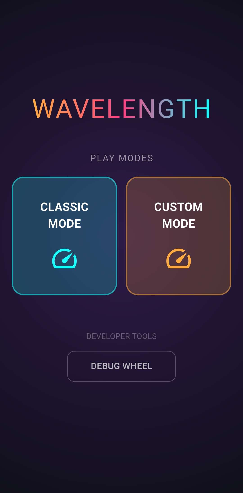
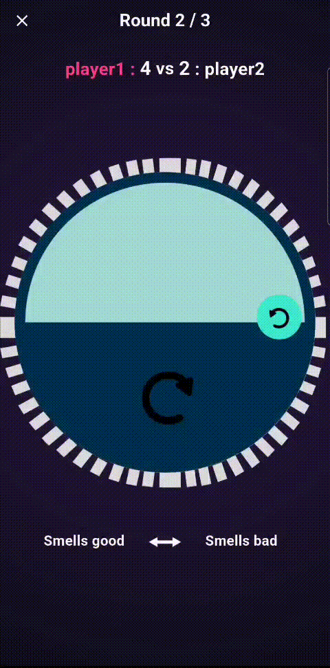
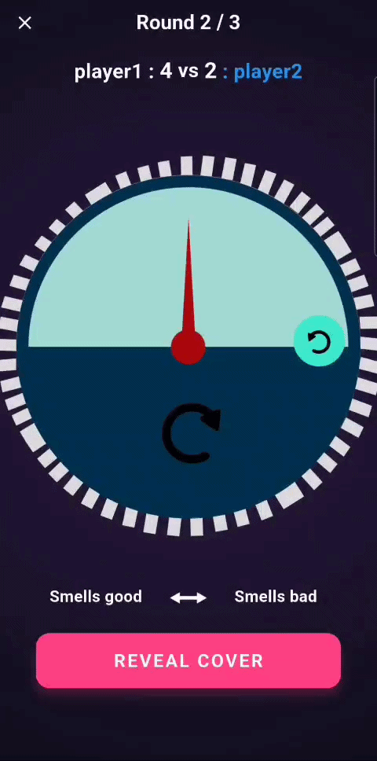
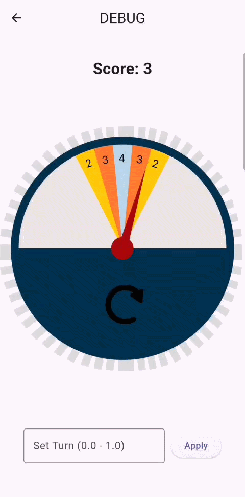
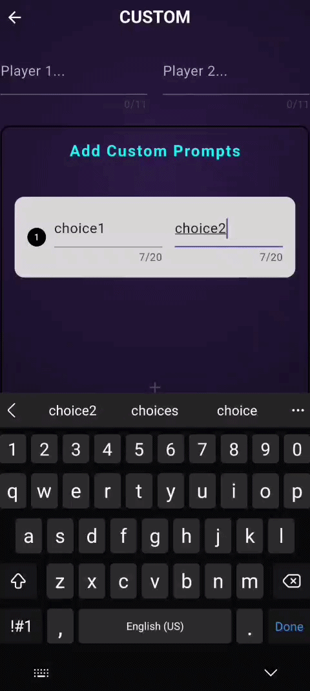
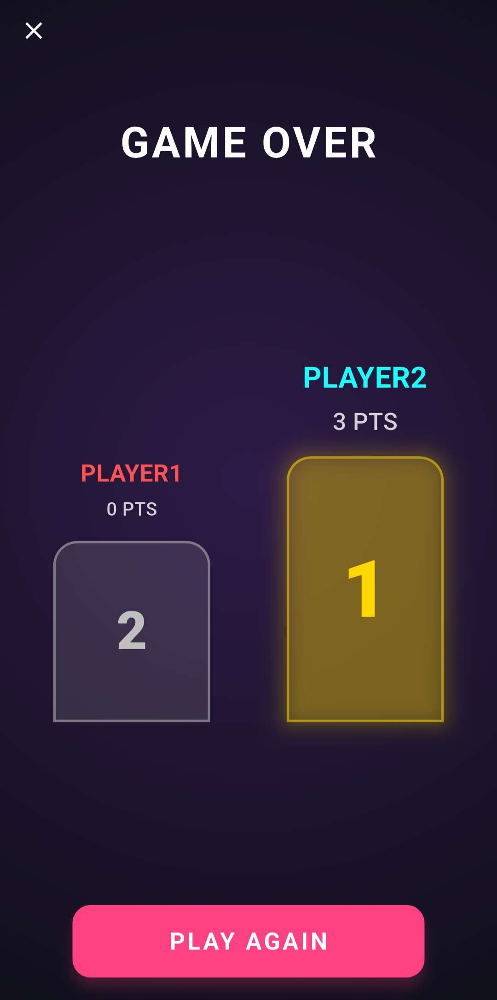

# 🔮 Wavelength

## 🎓 Project Context

This project was developed as a way for me to learn the Flutter framework and as a personalized birthday gift for a friend.

---

## 🎮 Project Overview

A mobile adaptation of the popular social guessing game **Wavelength**. Players compete to see how well they can read each other's minds by guessing where a hidden target lies on a spectrum between two opposing concepts.

---

## 🛠️ Features

The application provides two main game modes.

### 🏛️ Classic Mode
Dynamically loads over 100 predefined prompts from GitHub Raw. This asynchronous approach enables real-time content updates without requiring users to download new application versions.

### 🎨 Custom Mode
Allows players to create their own pairs of opposing concepts using a dynamic form.

### 🛠️ Developer Tools
* **Debug Wheel**: Includes a specialized debug tool to manually test and verify the responsiveness and accuracy of the needle physics and animations.

### ♾️ Cross-Platform
Full support for **Android**, **iOS**, **macOS**, **Linux**, **Windows**, and **Web**.

---

### 🕹️ Gameplay Demo

  <table border="0">
    <tr>
      <td align="center">
        
<b>Main Menu</b>

        
      </td>
      <td align="center">
        
<b>Psychic's turn</b>

        
      </td>
      <td align="center">
        
<b>Guesser's turn</b>

        
      </td>
    </tr>
    <tr>
      <td align="center">
        
<b>Debug Wheel</b>

        
      </td>
      <td align="center">
        
<b>Custom menu</b>

        
      </td>
      <td align="center">
        
<b>Final Scoring</b>

        
      </td>
    </tr>
  </table>

---

## 🔗 Useful Links

* 📝 **[Prompts Repository](https://github.com/MihaiSvn/wavelength-prompts)** – View the JSON source and the full list of game prompts.
* 🌐 **[Wavelength Web](https://mihaisvn.github.io/wavelength-web/)** – Play the web-optimized version of the game.